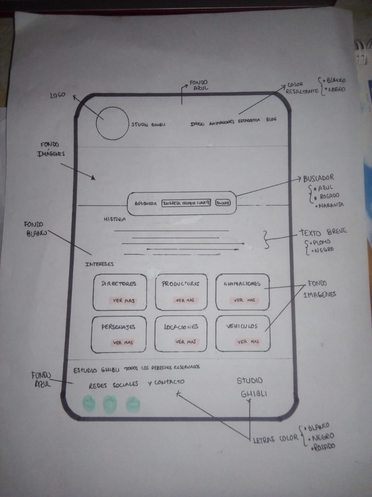
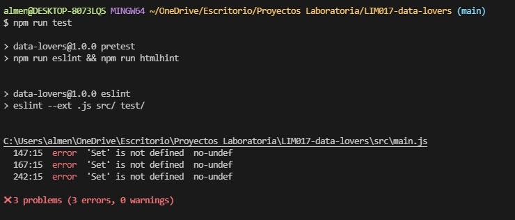

# Data Lovers

## Índice

* [1. Introducción](#1-Introducción)
* [2. Resumen del proyecto](#2-resumen-del-proyecto)
* [3. Historias de usuario](#3-Historias-de-usuario)
* [4. Plan de acción](#4-Plan-de-acción)
* [5. Problemas detectados en test de usabilidad](#5-Problemas-detectados-en-test-de-usabilidad)
***
## 1.Introducción
En este proyecto desarrollaremos una página web que permita visualizar un conjunto de datos de Studio Ghibli y manejarlo a través de filtrados, ordenamientos y/o cálculos agregados.
## 2.Resumen del proyecto
#### ¿Quiénes son los principales usuarios del producto?
Nuestro producto se dirige a todas las personas que sean fans de las animaciones producidas por Studio Ghibli, o se sientan de alguna forma identificadas con la animación, personajes, etc y deseen conocer más.
#### ¿Cuáles son los objetivos de estos usuarios en relación con el producto?
Adquirir información ordenada, de forma rápida y fácil.
#### ¿Cuáles son los datos más relevantes que quieren ver en la interfaz y por qué?
Los datos más relevantes que desean conocer son:
* Personajes: Edad, género, nombre, animación.
    Porque desean conocer cuántos y cuáles son.
    A la vez que existen muchas especies, por ello para los usuarios es importante saber que tipos de especies existen.
* Directores y productores: Peliculas realizadas
    Porque ellos son las mentes detrás de una gran animación. Además muchos usuarios quieren conocer qué películas han desarrollado sus directores favoritos.
* Animaciones: fecha de estreno, directores productores descripción y personajes.

#### ¿Cuándo utilizarían el producto?
Cuando deseen confirmar la información de las animaciones realizadas por Studios Ghibli.
## 3.Historias de usuario
Planificamos 6 historias de usuario que describen en los criterios de aceptación las funcionalidades técnicas y usuarias que mínimamente tienen que cumplirse. Dichas historias de usuario, fueron desglosadas en tareas que fueron asignadas a cada programadora.

#### Desarrollo
Primero decidimos preparar y revisar los recursos necesarios para el desarrollo del proyecto, uno de ellos fue comprender cuales eran las [necesidades del usuario](https://github.com/Laboratoria/LIM017-data-lovers/blob/main/src/data/ghibli/README.md).
#### Prototipo de baja fidelidad
###### Boceto 1: Landing
Decidimos implementar 4 cards que al seleccionarlos filtracen las peliculas por director/productor, personajes, vehículos y locaciones.

###### Boceto 2: Landing
Decidimos separar directores de productores y añadimos la sección de animaciones. Considerando que sería más ordenado y funcional.

#### Prototipo de alta fidelidad
Decidimos que añadir un menú, nos permitiría ordenar las vistas y añadaría interactividad con el usuario.
Puedes ver el prototipo de alta fidelidad desarrollado en Figma [aquí](https://www.figma.com/proto/Jg16yUfSaE4coBU1KYgqbn/Data-Lovers?node-id=0%3A1)
## 4.Plan de acción
#### Objetivos de aprendizaje Priorizados
###### Briggtte
1. Aprender a usar las MediaQueries para realizar el diseño responsive de la página.
2. Consolidar conocimientos: Diferenciar margin y padding, usar flex-box para maquetar los elementos de la página, etc, usar space-content y las diferentes propiedades que tiene.
3. Mejoré el manejo del DOM para luego usarlos mediante funciones en main.js.
4. Mejoré la implementación de los módulos ECMAScript para importar y exportar las funciones entre diferentes archivos.
5. Aprendí cómo realizar pruebas unitarias a las funciones de nuestro código, la sintaxis y la utilidad de las mismas.
6. Aprendí a trabajar colaborativamente en Github, al inicio tuvimos conflictos pero luego fue mucho más sencillo ya que los comandos se volvieron parte de nuestra rutina diaria.
###### Jammie
1. Aprender un poco más de CSS, logrando conocer el uso del flexbox y algunas de sus propiedades como flex-direction:column, permitiendome distribuir de mejor manera cada item. Conocí tambien el uso de position relative y absolute, permitiendome posicionar un item superpuesto sobre otro. Conocí la propiedad de hover y referenciación dentro de la misma página sin necesidad de usar javascript.
2. Aprendí el uso de métodos de array como: filter, map, sort. También la forma de recorrer un array haciendo uso de forEach. Permitiendome desarrollar mejor las funciones requeridas.
3. Aprendí un poco de la sintaxis de las pruebas unitarias.
4. También comprender mejor e implementar adecuadamente la forma de importar y exportar (Módulos de ECMAScript).
5. Mejorar el desarrollo e implementación de funciones, Uso del DOM y lógica en Javascript.
## 5.Problemas detectados en test de usabilidad
#### Problema 1:
Al correr el primer test, tuvimos un error con la función Set() ya que el package no la reconocía; la función sí realizaba el filtrado; sin embargo el test no se ejecutaba.

Para solucionar el problema, se insertó una línea de código en el archivo main.js para deshabilitar lo indefinido. Luego, en el archivo .eslintrc se colocó en el env el código "es6": true.

#### Problema 2:
Luego de ejecutar el test, pudimos identificar que el test salió un error ya que el array inicial era extenso, entonces creamos un nuevo array con los datos a testear.

En base a ello, se prosiguió con testear las demás funciones del archivo data.js, consiguiendo finalmente npm run test
100% en Stmts, Funcs, Lines y 87.5% en Branch.